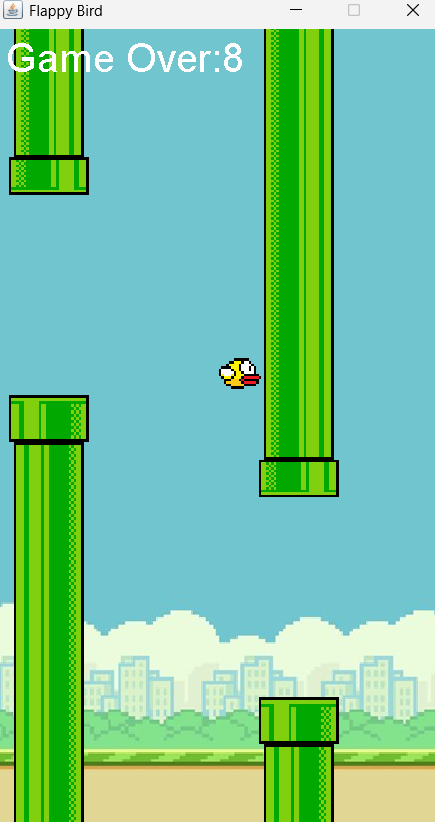

# Flappy Bird Clone

A simple and fun Flappy Bird game clone built with Java.

## Features
- Classic Flappy Bird gameplay
- Randomly generated obstacles
- Score tracking


## Screenshots



## Installation

1. Clone the repository:
    ```bash
    git clone https://github.com/yourusername/flappybird.git
    ```

2. Navigate to the project directory:
    ```bash
    cd /FlappyBird/src
    ```

3. Compile the project:
    ```bash
    javac -d bin src/*.java
    ```

4. Run the game:
    ```bash
    java -cp bin Main
    ```

## How to Play
- Press `Space` or `Up Arrow` to make the bird fly.
- Avoid obstacles and keep the bird in flight.
- Try to get the highest score!

## Dependencies
- Java JDK 8 or higher

Ensure that you have Java installed and configured. You can check your Java version with:
```bash
java -version
```


## Contribution
Contributions are welcome! If you'd like to improve this game or add new features:

1. Fork the repository
2. Create a new branch (`git checkout -b feature-name`)
3. Commit your changes (`git commit -m 'Add feature'`)
4. Push to the branch (`git push origin feature-name`)
5. Open a pull request

## License
This project is licensed under the [MIT License](LICENSE).

## Acknowledgements
- Inspired by the original Flappy Bird by Dong Nguyen.


